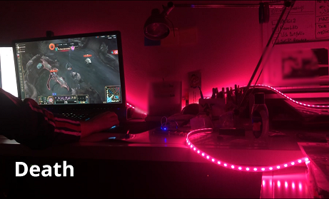
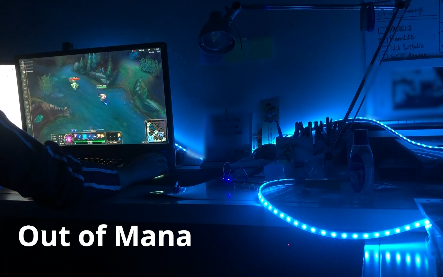

# leagueoflegends-led
A modular League of Legends integration for Razer Chroma and RGB LED devices.

## Features
- Health Bar
- Death Lights
- Keeps track of cooldowns and mana
- Custom spellcast animations for several champions
- Compatible with E1.31 devices
- Razer Chroma support

## Usage
- Setup a LED strip that listens to color data via sACN. If you don't have a LED strip, you will be able to see the simulated LED display in your screen. Alternatively, if you have a Razer Chroma Keyboard, the program should work out of the box!
- Open the program. It will default to Razer Chroma mode. If you want to use it with an LED strip, click on "Use LED strip".
- Load into a LoL game (preferably with Vel'Koz)
- Enjoy the lights!

## Roadmap / Planned Features
- Animation sets for each champion
- Effects for summoner spells
- Effects for items
- Improve support for keyboard animations

## Known Issues
- Window focus isn't taken into account
- Game chat isn't taken into account (keypresses are treated as ability casts)

## Contributing
Check out the [contributing guide](CONTRIBUTING.md). Help is greatly appreciated with anything, really.
